# Diagrama Entidad-Relación (ERD) — Fase 1 (PostgreSQL)

## 1. Visión General de la Arquitectura de Datos

La base de datos de Fase 1 implementa un esquema unificado (*shared schema*) multi-tenant con **Row Level Security (RLS)** forzado a nivel de motor. Se divide en cuatro dominios funcionales:
1. **Identidad, Organización y Membresías (Global & RBAC):** `tenants`, `users`, `memberships`.
2. **Contabilidad y Libro Diario (IFRS / Partida Doble):** `accounting_accounts`, `journal_entries`, `journal_lines`.
3. **Gestión Documental y Rendición de Gastos:** `documents`, `expenses`.
4. **Facturación y Cumplimiento Tributario (SII Chile):** `dte_invoices`, `dte_invoice_items`.

---

## 2. Diagrama Entidad-Relación (Mermaid)

```mermaid
erDiagram
    %% ==========================================
    %% DOMINIO 1: IDENTIDAD Y TENANCY (GLOBAL / RBAC)
    %% ==========================================
    TENANTS {
        uuid id PK "gen_random_uuid()"
        text name "Razón social / Nombre de fantasía"
        text tax_id "RUT o identificador fiscal único"
        text status "active | suspended | deleted"
        timestamptz created_at "Audit timestamp"
        timestamptz updated_at "Audit timestamp"
    }

    USERS {
        uuid id PK "gen_random_uuid()"
        text email UK "Correo único normalizado en minúsculas"
        text name "Nombre completo del operador"
        text password_hash "Hash seguro (Argon2id/Bcrypt)"
        text status "active | invited | disabled | deleted"
        timestamptz created_at "Audit timestamp"
        timestamptz updated_at "Audit timestamp"
    }

    MEMBERSHIPS {
        uuid id PK "gen_random_uuid()"
        uuid tenant_id FK "Cascade delete"
        uuid user_id FK "Cascade delete"
        text role "owner | admin | accountant | approver | member | viewer"
        timestamptz created_at "Fecha de asignación"
    }

    %% ==========================================
    %% DOMINIO 2: CONTABILIDAD Y LIBRO DIARIO
    %% ==========================================
    ACCOUNTING_ACCOUNTS {
        uuid id PK "gen_random_uuid()"
        uuid tenant_id FK "Cascade delete (RLS)"
        uuid parent_id FK "Jerarquía opcional (Set null)"
        text code "Código estructurado jerárquico (ej. 1110101)"
        text name "Nombre de la cuenta contable"
        text account_type "asset | liability | equity | income | expense"
        boolean is_active "Habilitada para imputar"
        timestamptz created_at "Audit timestamp"
        timestamptz updated_at "Audit timestamp"
    }

    JOURNAL_ENTRIES {
        uuid id PK "gen_random_uuid()"
        uuid tenant_id FK "Cascade delete (RLS)"
        date entry_date "Fecha contable de devengo"
        text description "Glosa general del comprobante"
        text status "draft | posted | voided"
        numeric total_debit "Sumatoria débitos (>= 0)"
        numeric total_credit "Sumatoria créditos (>= 0)"
        timestamptz posted_at "Fecha de contabilización"
        timestamptz created_at "Audit timestamp"
        timestamptz updated_at "Audit timestamp"
    }

    JOURNAL_LINES {
        uuid id PK "gen_random_uuid()"
        uuid tenant_id FK "Cascade delete (RLS)"
        uuid entry_id FK "Cascade delete"
        uuid account_id FK "Restrict delete"
        numeric debit "Debe (>= 0)"
        numeric credit "Haber (>= 0)"
        text memo "Glosa específica de la línea"
        timestamptz created_at "Audit timestamp"
    }

    %% ==========================================
    %% DOMINIO 3: DOCUMENTOS Y GASTOS OPERACIONALES
    %% ==========================================
    DOCUMENTS {
        uuid id PK "gen_random_uuid()"
        uuid tenant_id FK "Cascade delete (RLS)"
        text filename "Nombre original del archivo"
        text mime_type "application/pdf, image/png, etc."
        bigint size_bytes "Tamaño en bytes"
        text checksum_sha256 "Hash SHA-256 para deduplicación"
        text storage_provider "local | s3 | gcs | azure"
        text storage_uri "Ruta o URI en almacenamiento"
        timestamptz created_at "Audit timestamp"
    }

    EXPENSES {
        uuid id PK "gen_random_uuid()"
        uuid tenant_id FK "Cascade delete (RLS)"
        date expense_date "Fecha del desembolso"
        numeric amount "Monto total del gasto (>= 0)"
        text currency "CLP | USD"
        text status "draft | submitted | approved | paid | rejected"
        uuid document_id FK "Comprobante digital adjunto (Set null)"
        text description "Justificación del gasto"
        text merchant "Comercio o proveedor"
        timestamptz created_at "Audit timestamp"
        timestamptz updated_at "Audit timestamp"
    }

    %% ==========================================
    %% DOMINIO 4: FACTURACIÓN TRIBUTARIA (SII CHILE)
    %% ==========================================
    DTE_INVOICES {
        uuid id PK "gen_random_uuid()"
        uuid tenant_id FK "Cascade delete (RLS)"
        text dte_type "Código SII (33, 34, 39, 41, 52, 61, etc.)"
        integer folio "Número correlativo tributario (> 0)"
        date issue_date "Fecha de emisión legal"
        text status "draft | issued | accepted | rejected | annulled"
        text currency "CLP | USD"
        text recipient_rut "RUT receptor del DTE"
        text recipient_name "Razón social del receptor"
        numeric subtotal "Monto neto afecto o exento"
        numeric tax_amount "Monto de IVA (19%) o impuestos específicos"
        numeric total "Monto bruto final (>= 0)"
        text sii_receipt_uri "URI de acuse de recibo SII"
        text sii_track_id "Track ID de envío al SII"
        timestamptz emitted_at "Estampa de tiempo de timbraje"
        timestamptz created_at "Audit timestamp"
        timestamptz updated_at "Audit timestamp"
    }

    DTE_INVOICE_ITEMS {
        uuid id PK "gen_random_uuid()"
        uuid tenant_id FK "Cascade delete (RLS)"
        uuid dte_invoice_id FK "Cascade delete"
        integer line_number "Ordinal de la línea en XML (> 0)"
        text description "Glosa del producto/servicio"
        numeric quantity "Cantidad (>= 0)"
        numeric unit_price "Precio unitario neto (>= 0)"
        numeric discount "Descuento aplicado (>= 0)"
        numeric tax_rate "Tasa impositiva (ej. 19.00)"
        numeric tax_amount "Monto impuesto línea (>= 0)"
        numeric line_total "Total final línea (>= 0)"
        uuid account_id FK "Pre-imputación contable (Set null)"
        timestamptz created_at "Audit timestamp"
    }

    %% ==========================================
    %% RELACIONES Y CARDINALIDADES
    %% ==========================================
    TENANTS ||--o{ MEMBERSHIPS : "agrupa usuarios mediante"
    USERS ||--o{ MEMBERSHIPS : "participa en empresas mediante"

    TENANTS ||--o{ ACCOUNTING_ACCOUNTS : "posee catálogo"
    ACCOUNTING_ACCOUNTS ||--o{ ACCOUNTING_ACCOUNTS : "jerarquía (padre/hijo)"

    TENANTS ||--o{ JOURNAL_ENTRIES : "registra asientos"
    JOURNAL_ENTRIES ||--o{ JOURNAL_LINES : "contiene partidas"
    ACCOUNTING_ACCOUNTS ||--o{ JOURNAL_LINES : "recibe imputaciones"

    TENANTS ||--o{ DOCUMENTS : "almacena archivos"
    TENANTS ||--o{ EXPENSES : "administra rendiciones"
    DOCUMENTS ||--o| EXPENSES : "respalda opcionalmente"

    TENANTS ||--o{ DTE_INVOICES : "emite y recibe DTEs"
    DTE_INVOICES ||--o{ DTE_INVOICE_ITEMS : "detalla líneas"
    ACCOUNTING_ACCOUNTS ||--o{ DTE_INVOICE_ITEMS : "asocia cuenta contable"
```



---

## 3. Matriz de Relaciones y Reglas de Integridad Referencial

| Tabla Origen (Hija) | Columna FK | Tabla Destino (Padre) | Acción ON DELETE | Razón Técnica |
|---|---|---|---|---|
| `memberships` | `tenant_id` | `tenants(id)` | `CASCADE` | Si se elimina el tenant, se revocan todas sus membresías asociadas. |
| `memberships` | `user_id` | `users(id)` | `CASCADE` | Si se elimina un usuario, se limpian sus asociaciones. |
| `accounting_accounts` | `tenant_id` | `tenants(id)` | `CASCADE` | Catálogo de cuentas pertenece exclusivamente a su tenant. |
| `accounting_accounts` | `parent_id` | `accounting_accounts(id)` | `SET NULL` | Si se elimina una cuenta mayor, sus subcuentas quedan sin padre (no se eliminan). |
| `journal_entries` | `tenant_id` | `tenants(id)` | `CASCADE` | Libro diario aislado por tenant. |
| `journal_lines` | `entry_id` | `journal_entries(id)` | `CASCADE` | Las partidas contables no tienen existencia independiente del asiento cabecera. |
| `journal_lines` | `account_id` | `accounting_accounts(id)` | `RESTRICT` | **Prohíbe eliminar cuentas contables que tengan movimientos históricos.** |
| `expenses` | `document_id` | `documents(id)` | `SET NULL` | Si se depura un archivo físico, el gasto contable se conserva con referencia nula. |
| `dte_invoices` | `tenant_id` | `tenants(id)` | `CASCADE` | Registro tributario aislado por tenant. |
| `dte_invoice_items` | `dte_invoice_id` | `dte_invoices(id)` | `CASCADE` | Las líneas de un DTE se eliminan junto con su comprobante padre. |
| `dte_invoice_items` | `account_id` | `accounting_accounts(id)` | `SET NULL` | La desvinculación de la cuenta contable no borra la línea tributaria del DTE. |

---

## 4. Reglas Críticas de Integridad Contable y Tributaria

1. **Partida Doble Estricta:**
   - Cabecera: `CHECK (total_debit = total_credit)` en `journal_entries`.
   - Líneas de detalle: Cada registro en `journal_lines` debe ser exclusivamente débito o exclusivamente crédito (`CHECK (NOT (debit > 0 AND credit > 0))` y `CHECK (NOT (debit = 0 AND credit = 0))`).
2. **Unicidad Compuesta de Cuentas Contables:**
   - La restricción `UNIQUE (tenant_id, code)` en `accounting_accounts` permite que múltiples empresas compartan el mismo plan de cuentas estándar (ej. cuenta `1110101` para Caja) sin colisiones de clave ni filtrado cruzado.
3. **Unicidad Tributaria Legal (SII Chile):**
   - La restricción `UNIQUE (tenant_id, dte_type, folio)` en `dte_invoices` garantiza el cumplimiento legal estricto ante el Servicio de Impuestos Internos: un mismo tenant jamás puede duplicar un folio para un mismo tipo de documento (Factura 33, Factura Exenta 34, Boleta 39, Nota de Crédito 61).
4. **Protección Multi-Tenant mediante Row Level Security:**
   - Las 7 tablas de negocio (`accounting_accounts`, `journal_entries`, `journal_lines`, `documents`, `expenses`, `dte_invoices`, `dte_invoice_items`) cuentan con RLS activo y forzado contra la sesión transaccional:
     ```sql
     USING (tenant_id = NULLIF(current_setting('app.tenant_id', true), '')::uuid)
     WITH CHECK (tenant_id = NULLIF(current_setting('app.tenant_id', true), '')::uuid);
     ```
