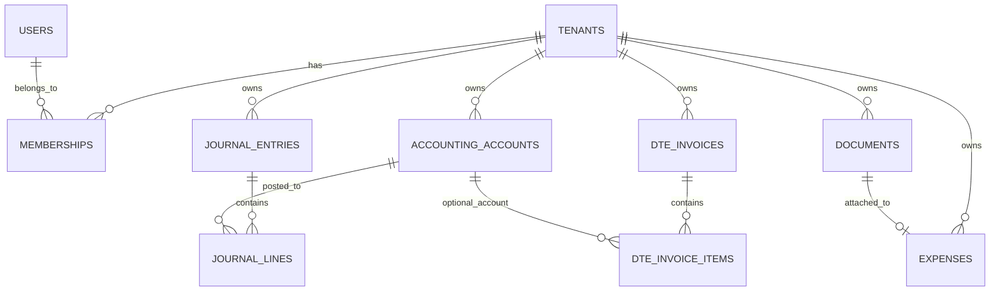

# ERD Fase 1

## Notas de Integridad y Aislamiento

- **Aislamiento por `tenant_id`:** Todas las tablas de negocio incluyen la columna `tenant_id UUID NOT NULL REFERENCES tenants(id) ON DELETE CASCADE`.
- **Membresías:** La tabla `memberships` desacopla usuarios de tenants, permitiendo que un mismo usuario opere en múltiples empresas con roles independientes (`owner`, `admin`, `accountant`, `approver`, `member`, `viewer`).
- **Partida Doble (Balance):** `journal_entries` exige `total_debit = total_credit`.
- **Partida Doble (Líneas puras):** Cada registro en `journal_lines` debe ser débito puro o crédito puro (`CHECK (NOT (debit > 0 AND credit > 0))` y `CHECK (NOT (debit = 0 AND credit = 0))`).
- **Respaldo Documental:** Un registro en `expenses` puede respaldarse opcionalmente con un archivo en `documents` (`document_id REFERENCES documents(id) ON DELETE SET NULL`).
- **Unicidad Tributaria:** La tabla `dte_invoices` garantiza unicidad mediante la restricción compuesta `UNIQUE (tenant_id, dte_type, folio)`.
- **Row Level Security (RLS):** Las 7 tablas de negocio aplican políticas RLS activadas y forzadas a nivel de motor contra la variable de sesión `app.tenant_id`.
